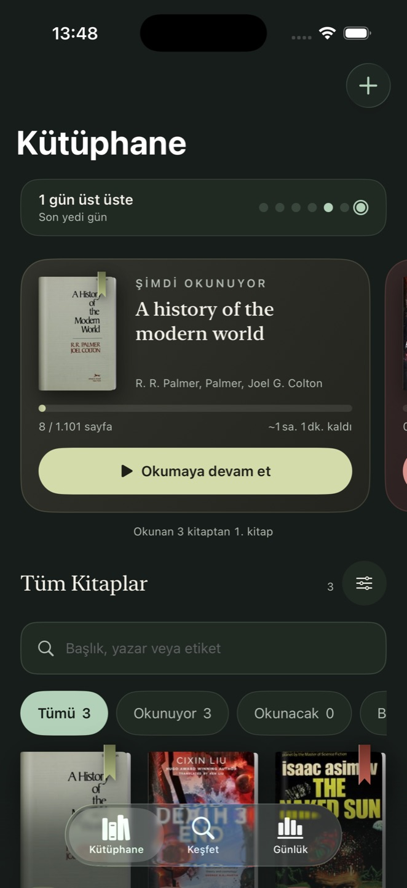
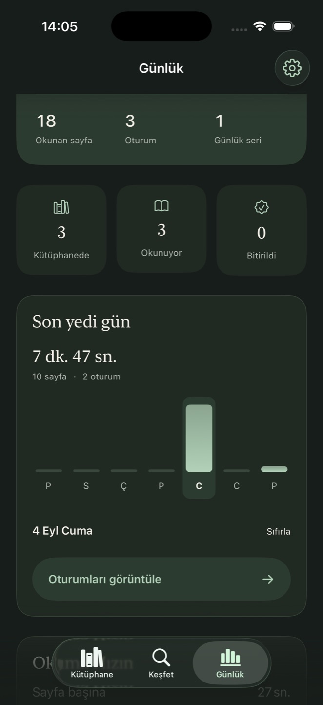
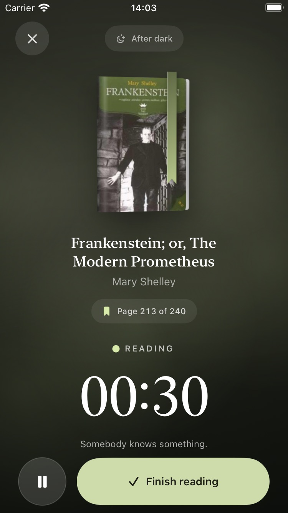

# BookTrace — sekme ve okuma akışı incelemesi

6 Eylül 2026

Bu belgedeki test sayıları inceleme tarihinde çalıştırılan kapsamı gösterir; güncel HEAD toplamı değildir. Yeni doğrulamalar için [CI koşumlarına](https://github.com/semihtakilan/BookTrace/actions/workflows/ci.yml) ve ilgili commit’in test çıktılarına bakın.

Bu çalışma Library, Discover, Journal, Settings ve okuma oturumu akışını çalışan uygulama üzerinden değerlendirdi. Amaç, mevcut kâğıt/mürekkep tasarım dilini ve MVVM–repository ayrımını koruyarak kitap bulma, okumaya devam etme ve geçmişe dönme işlerini daha anlaşılır hâle getirmekti. İnceleme önce simülatör ekran görüntüleriyle yapıldı; etkileşim hataları kod ve testlerle doğrulandı.

## Bulgular ve değişiklikler

### Library: her kitabın bulunabildiği tek raf

Önceki raf, **Reading** durumundaki kitapları arama ve filtrelerin dışında bırakıyordu. Yalnızca okumakta olduğu kitapları bulunan bir kullanıcının rafı boş görünebiliyor; arama, ekranda görünen bir kitabı bulamıyordu.

**All Books** artık tüm kayıtları kapsıyor. Arama, durum filtreleri, gruplama ve sıralama aynı kitap kümesi üzerinde çalışıyor; filtre adetleri arama sonucunu yansıtıyor. Bir kitap birden fazla etikette görünse de sonuç sayısı tekil tutuluyor. **Now Reading** son okunan kitapları öne çıkaran daha kompakt bir kısayol olarak korundu; arama veya filtre etkin olduğunda sonuçların önünden çekiliyor.

Son eşleşme silindiğinde ya da başka duruma taşındığında kullanıcı boş sonuç açıklamasından filtreleri sıfırlayabiliyor. Kütüphane tamamen boşalırsa eski filtreler temizleniyor; sonradan eklenen ilk kitap gizlenmiyor. Kitap menüsünden durum değiştirmek mevcut ilerlemeyi ve oturum geçmişini koruyor.

Elle ilerleme girişinde geçersiz, negatif ve sayfa sınırını aşan değerler kaydedilemiyor. Toplam sayfası bilinmeyen kitaplara mevcut sayfa girilebiliyor; yüzde hesabı için toplam sayfa gerekiyor. Oturum kaydında domain tarafından kırpılan sayfa sayısı kalıcı depoya da aynı biçimde yazılıyor; fazla sayfalar Journal toplamlarını veya hız tahminini şişirmiyor.

### Discover: sorguyla tutarlı sonuçlar

Mevcut kapak kartları, konu koleksiyonları ve kısa kitap rafı korundu. Asıl sorun görünümden bağımsız bir istek yarışıydı: yavaş veya iptal edilmiş eski bir arama, yeni sorgunun sonucunu ya da temizlenmiş ekranı değiştirebiliyordu.

Her arama artık kendi istek kimliğiyle doğrulanıyor. Sorgu değiştiği anda eski sonuçlar kaldırılıyor; geç gelen yanıtlar ve hatalar yeni sonucu ezemiyor. Kitap kimliğine göre tekrarlanan sonuçlar tekilleştiriliyor; aynı raf veya barkod için eşzamanlı tekrar işlemleri engelleniyor.

### Journal: istatistikten okunabilir geçmişe

Yedi günlük grafik artık etkileşimli. Kullanıcı bir güne dokunarak o günün süresini, sayfasını ve oturum sayısını görebiliyor; boş günlerde açıklama, dolu günlerde **View sessions** eylemi gösteriliyor. Gün seçimi sıfırlanabiliyor ve grafiğin nasıl kullanılacağı görünür bir ipucuyla anlatılıyor.

**Recent Sessions** beş kayıttan oluşan özeti koruyor; **See all** bütün geçmişi yerel takvim günlerine göre grupluyor. Oturum satırı kitabın kütüphane detayına açılıyor; böylece ilerleme ve okumaya devam etme eylemi erişilebilir oluyor. Büyük erişilebilirlik yazı boyutlarında metrikler dikey yerleşiyor. Settings’in mevcut görünüm, dil ve yeni kitap varsayılanları akışı korundu.

### Okuma modu: kapağa ait atmosfer, güvenilir oturum

Okuma odasının ışığı ve bulanık arka plan dokusu kitabın kapağından geliyor; tür, hareket ve atmosferi tamamlıyor. Kitapla ilişkili başlık ve oda ayrıntıları korunurken sayaç ve ana eylemler öncelikli kalıyor. Tür eşleştirmesinde sözcük sınırları kullanılıyor: örneğin “universe” içindeki “verse” veya “award” içindeki “war” artık yanlış tema seçtirmiyor. Aynı türdeki farklı kapaklar kendi renk kimliklerini koruyor.

İlk görsel kontrolde üst bölümde fark edilen arka plan birleşim çizgisi, tek ve tam ekran arka plan yerleşimiyle düzeltildi. Küçük cihazdaki sonraki kontrolde kapağın çevresinde kalan hafif katman sınırı için tekrarlanan yerel ışık halesi kaldırıldı. Polisiye temasının sisi ve tarih temasının hareketli ışık geçişi, keskin kırpılma kenarlarını azaltacak biçimde yumuşatıldı. Süre ve ilerleme metinlerinin okunabilirliği de gözden geçirildi.

Oturumun bitirme ekranından geri dönüşü önceki duraklatma durumunu koruyor; girilmiş sayfa sayısı kaybolmuyor. **Discard** oturumu gerçekten kapatıyor. Kaydetme doğrulaması view model içinde de uygulanıyor ve aynı oturum ikinci kez kaydedilemiyor. İlerleme önizlemesi kayıttan sonraki sayfayı gösteriyor. Bitmiş kitapta **Track reading time**, geçmişi veya ilerlemeyi sıfırlamadan yalnızca süre kaydediyor; bitirme ekranı bunu açıkça belirtiyor. Sıfır süreli kayıtlar kişisel hız hesabına katılmıyor.

## Doğrulama

| Kontrol | Sonuç |
| --- | --- |
| `Models` testleri | 71 test geçti. |
| Uygulama testleri | iOS 18.4, iPhone SE simülatöründe 147 test geçti. |
| Derleme | Debug ve son Release simülatör derlemeleri başarılı. |
| Library arama | Reading durumundaki kitap aramayla bulundu; eşleşmeyen aramadan sıfırlama ile tüm kitaplara dönüldü. |
| Oturum geri dönüşü | Duraklat → bitir → geri dön akışında sayaç duraklatılmış kaldı. |
| Oturumu bırakma | Discard sonrası Library’ye dönüldü. |
| Journal gezinmesi | Seçilen günün iki eşleşen oturumu açıldı; oturumdan kitabın Library detayına geçildi. |
| Küçük cihaz | iPhone SE’de açık görünüm, Discover, tam geçmiş ve okuma ekranı incelendi. Accessibility Large yazı boyutunda sayaç ve kontroller görünür kaldı; ardından önceki Medium ayarı geri yüklendi. |
| Geçmişin tamamı | SE’de önceden bulunan 11 oturumun tamamı geçmiş ekranının erişilebilirlik ağacında doğrulandı; liste beş kayıtla sınırlanmadı. |
| Yerelleştirme | Önceden var olan kullanıcı çevirileri birebir korundu; 14 yeni anahtar İngilizce, Türkçe ve Almanca olarak eklendi. |

Yeni regresyon kapsamı; eski arama yanıtları ve hataları, sorgu temizleme, filtre ve sonuç sayıları, tamamen boşalan kütüphaneye yeniden kitap ekleme, ilerleme girişi, kırpılmış oturumun kalıcı kaydı, duraklatma/kaydetme/bırakma geçişleri ve tüm geçmişin yerel günlere ayrılmasını içeriyor. Simülatör etkileşimleri otomatik UI testleri olarak sunulmuyor; bunlar elle yürütülen ekran ve akış kontrolleridir.

SE’de görülen 11 kayıt, incelemeden önce var olan kısa ve sentetik test oturumlarıdır. Bu verilerden hesaplanan hız gerçek bir kullanıcının okuma performansı olarak yorumlanmamalıdır. Bu incelemede elle başlatılan yeni deneme oturumları kalıcı kaydedilmeden bırakıldı.

## Ekran kanıtları

| Ekran | Görüntü |
| --- | --- |
| Library başlangıcı | [01-library-before.jpg](01-library-before.jpg) |
| Discover başlangıcı | [02-discover-before.jpg](02-discover-before.jpg) |
| Journal başlangıcı | [03-journal-before.jpg](03-journal-before.jpg) |
| Settings başlangıcı | [04-settings-before.jpg](04-settings-before.jpg) |
| Okuma modu başlangıcı | [05-reading-before.jpg](05-reading-before.jpg) |
| Oturum bitirme başlangıcı | [06-finish-before.jpg](06-finish-before.jpg) |
| Library, Türkçe | [07-library-final-tr.jpg](07-library-final-tr.jpg) |
| Library arama kontrolü | [08-library-search.jpg](08-library-search.jpg) |
| Okuma odası ara sürümü | [09-reading-first-pass.jpg](09-reading-first-pass.jpg) — birleşim çizgisinin fark edildiği ara sürüm; son tasarım değildir. |
| Bilimkurgu okuma odası | [10-reading-scifi-final.jpg](10-reading-scifi-final.jpg) |
| Oturum bitirme ve ilerleme önizlemesi | [11-finish-preview-final.jpg](11-finish-preview-final.jpg) |
| Tarih kitabının okuma odası | [12-reading-history-final.jpg](12-reading-history-final.jpg) |
| Library, açık görünüm, iPhone SE | [13-library-se-light.jpg](13-library-se-light.jpg) |
| Okuma modu, Accessibility Large, iPhone SE | [14-reading-se-accessibility.jpg](14-reading-se-accessibility.jpg) |
| Okuma modu küçük cihaz ara kontrolü | [15-reading-se-final.jpg](15-reading-se-final.jpg) — adına rağmen ara sürümdür; hafif katman sınırı sonrasında giderildi. |
| Discover, iPhone SE | [16-discover-se-final.jpg](16-discover-se-final.jpg) |
| Tam okuma geçmişi, iPhone SE | [17-history-se-final.jpg](17-history-se-final.jpg) |
| Journal son görünümü | [18-journal-final.jpg](18-journal-final.jpg) |
| Okuma modu, son küçük cihaz doğrulaması | [19-reading-se-verified.jpg](19-reading-se-verified.jpg) |

## Sınırlar

Bu çalışma kullanım akışlarını ve mevcut tasarımın tutarlılığını iyileştirir; kullanıcı edinimi veya geri dönüş oranı üzerindeki etkisi henüz ölçülmedi. Sonuç bir App Store yayımlama onayı ya da eksiksiz mağaza hazırlığı değerlendirmesi değildir.

Kamera ve gerçek barkod okuma fiziksel cihazda doğrulanmalıdır. Bu tur tam bir VoiceOver, fiziksel cihaz performansı veya pil tüketimi denetimi içermez. Kitap teması katalog metadatası ve mevcut kapaktan türetilir; eksik ya da hatalı katalog bilgisi sınıflandırmayı etkileyebilir. Okuma modu uygulama dışında okunan kitabın süresini ve ilerlemesini izler; EPUB/PDF okuyucusu eklenmedi. Kalıcı veri modeli, yerel saklama düzeni ve repository sınırları korundu.

## Son görünüm örnekleri

