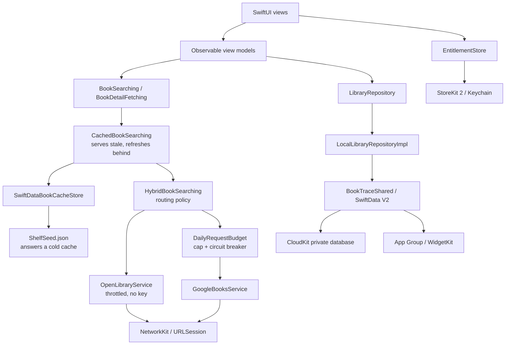

# BookTrace

BookTrace is a native iOS app for discovering books, organizing a personal library, and tracking reading time and progress. Find books through Open Library and Google Books, keep a library that works offline, and turn reading sessions into a record of your activity and pace. The app includes private iCloud synchronization, local recommendations, and optional BookTrace Pro features without requiring a BookTrace account.

Built with **SwiftUI**, **SwiftData**, and local **Swift packages**, the project uses MVVM and repository abstractions to keep presentation, persistence, networking, and domain logic separate.

## Contents

- [Features](#features)
- [Free and Pro](#free-and-pro)
- [Reading experience](#reading-experience)
- [Technology stack](#technology-stack)
- [Requirements](#requirements)
- [Getting started](#getting-started)
- [Book data sources](#book-data-sources)
- [Google Books API configuration](#google-books-api-configuration)
- [Release setup](#release-setup)
- [Using BookTrace](#using-booktrace)
- [Architecture](#architecture)
- [Project structure](#project-structure)
- [Reading progress and estimates](#reading-progress-and-estimates)
- [Storage and offline behavior](#storage-and-offline-behavior)
- [Localization and appearance](#localization-and-appearance)
- [Build and test](#build-and-test)
- [Troubleshooting](#troubleshooting)
- [Project status and roadmap](#project-status-and-roadmap)

## Features

### Book discovery

- Search Open Library by title, author, or other search terms, with Google Books as a fallback. Search waits 500 ms after typing to reduce unnecessary requests.
- Browse six featured shelves: Fiction, Science Fiction, History, Philosophy, Technology, and Biography.
- Scan book barcodes with the device camera and look up the corresponding ISBN.
- View book descriptions, authors, covers, subjects, page counts, publication dates, and ISBNs when available.
- Retry individual shelves when a request fails; each shelf loads independently.
- Discover personal recommendations scored locally from reading status, ratings, favorites, subjects, and authors; candidate books come from the cached catalogues.
- Show cached results immediately, with separate refresh and expiry windows for searches, subject shelves, and ISBN lookups.
- Load missing descriptions on demand, share concurrent requests for the same book, and reuse enriched metadata on later visits.

### Personal library

- Organize books by reading status: **Wishlist**, **To Read**, **Reading**, **Finished**, or **Abandoned**.
- Track ownership as **Borrowed**, **Not Owned**, or **Owned**.
- Add custom categories or choose suggestions from existing tags and the book's subjects.
- Set a page count and choose progress entry in pages or percentages.
- Search and filter **All Books**, including titles currently being read; use **Now Reading** to resume the most recently read books.
- Update existing library details while preserving reading progress and saved sessions.
- Rate books from one to five, mark favorites, and keep personal notes. Completion dates are recorded when books become Finished.
- Import Goodreads CSV files or a BookTrace JSON backup, preview the import, and keep existing progress and notes when matching entries merge.
- Remove individual books or erase the library from Settings. With iCloud enabled, deletions can propagate to your other devices.

### Reading sessions

- Start a full-screen timer from a book in your library.
- Pause and resume, then finish by recording the number of pages read.
- Save the session to advance progress and update the reading status when appropriate.
- Review a book's session history and accumulated reading time.
- Get a remaining-time estimate that adapts to the sessions recorded for that book.
- With Pro, show the active session on the Lock Screen and Dynamic Island through a Live Activity, including paused and resumed states.

Reading Mode tracks time spent reading a book outside the app; BookTrace does not currently include an EPUB or PDF reader.

### Journal and settings

- View library totals, books in progress, and finished books.
- Review total reading time, recorded pages, session counts, reading pace, and the current reading streak.
- See the last seven days of reading activity in Library; a streak ending yesterday remains active until today ends.
- Select a day in the activity chart to inspect its totals and sessions; browse the complete reading history by date and open any session’s book.
- Inspect reading-status and ownership breakdowns and the five most recent sessions.
- Choose System, Light, or Dark appearance.
- Switch between the system language, English, Turkish, and German.
- Set the default reading status and progress type for newly added books.
- Clear the search cache independently of the personal library.
- Check iCloud synchronization status, manage BookTrace Pro, and restore purchases from Settings.

### Goals, insights, and quotes

- Set daily, weekly, monthly, or yearly targets for minutes, pages, books, or sessions.
- Explore an annual reading heatmap, monthly time and page trends, pace over time, reading hours, subjects, ratings, and finished-book averages with Swift Charts.
- Save quotes with a page number, note, and favorite flag; search across the whole notebook or view one book’s quotes.
- Scan a page with on-device Vision OCR, edit the recognized text, and explicitly save it. Recognition support is checked at runtime; accuracy can vary by language.
- Share quote cards using the book’s cover palette and a BookTrace mark.
- View and share a basic year-in-review card for free; Pro adds the complete set and high-resolution exports.
- Export a Goodreads-compatible CSV or a full JSON backup containing books, sessions, quotes, and goals.
- Add Now Reading, Reading Streak, and Reading Goal widgets; supported widgets also offer Lock Screen accessory layouts.

## Free and Pro

There is no book-count limit or mandatory onboarding paywall. A paywall opens when a user requests a Pro action or visits **Settings → BookTrace Pro**.

| Free | BookTrace Pro |
| --- | --- |
| Unlimited books, discovery, search, and barcode lookup | Live Activities and widgets |
| Reading sessions, atmospheres, basic Journal statistics, and streaks | Creating and editing reading goals; detailed Swift Charts insights |
| Private iCloud synchronization and local recommendations | Creating and editing quotes, page OCR, and quote-card sharing |
| Goodreads CSV / BookTrace JSON import | CSV and full JSON export |
| Basic year-in-review card and standard-resolution sharing | All year-in-review cards and high-resolution sharing |

Existing quotes and goals remain readable when Pro expires. Free users can continue managing their books and recording sessions.

The US base catalogue is **$3.99 monthly**, **$24.99 yearly**, and **$59.99 lifetime**. Only the yearly subscription offers a **7-day free trial**, subject to Apple’s eligibility result. The yearly option is selected initially; prices use `Product.displayPrice`, and its savings badge is calculated from the current storefront’s monthly and yearly prices. The US configuration produces a 48% badge; other storefronts can differ. Lifetime is a separate non-consumable purchase, outside the subscription group.

See [Pricing.md](Pricing.md) for the regional pricing plan and [Release setup](#release-setup) for local testing and App Store configuration. The bundled StoreKit configuration describes local test products; it does not create or publish App Store Connect products.

## Reading experience

The interface uses a shared paper-and-ink design system with light and dark appearances, Dynamic Type, and English, Turkish, and German copy. Library’s **All Books** search, sorting, grouping, and status filters include every saved book, while **Now Reading** provides quick access to recently read titles. Adding a finished book completes its known page count. Discover offers subject spotlights, topic collections, a short-book shelf, and proportional cover grids. Book editing and session completion keep their save actions above the keyboard.

Cover palettes use a bounded LRU cache, batch persistence, and background JSON encoding; pending changes are flushed when the app becomes inactive. Book covers supply the color palette, while subjects and titles select one of ten visual atmospheres for details and Reading Mode. Ambient motion respects Reduce Motion and Low Power Mode. Session completion includes a page dial, keyboard entry, and projected progress, with brief celebrations for the first reading session, progress milestones, and finishing a book.

Journal combines reading time and personal pace with selectable daily activity and a complete session history that links back to each book.

See the [latest simulator design review](Documentation/DesignReview/Iteration4/Review.md) for the findings, screenshots, changes, and validation evidence.

## Technology stack

| Area | Technology | Role |
| --- | --- | --- |
| Interface | SwiftUI | Screens, forms, navigation presentation, and shared components |
| State | Observation | Observable view models and shared application settings |
| Persistence and sync | SwiftData / CloudKit | Versioned library schema, private iCloud sync, and local fallback |
| Purchases | StoreKit 2 / Keychain | Verified Pro entitlements, purchase and restore flows, and an offline cache |
| Widgets and Live Activities | WidgetKit / ActivityKit | App Group library access, Lock Screen widgets, and reading-session activity |
| Reading insights | Swift Charts | Reading calendar, trends, and distributions |
| Networking | Foundation / URLSession | Asynchronous requests through the local `NetworkKit` package |
| Dependency injection | [FactoryKit](https://github.com/hmlongco/Factory) | Service registration and dependency composition |
| Navigation | [NavigatorUI](https://github.com/hmlongco/Navigator) | Independent navigation stacks for each tab |
| Cover images | [Kingfisher](https://github.com/onevcat/Kingfisher) | Remote image loading and caching |
| Barcode and page scanning | AVFoundation / VisionKit / Vision | Barcode lookup and editable on-device text recognition |
| Localization | String Catalogs | English, Turkish, and German interface strings |
| Testing | Swift Testing / StoreKitTest | Domain, persistence, migration, purchase scenarios, widgets, and networking |

Dependencies are managed through Swift Package Manager. The committed Xcode [dependency resolution](BookTrace.xcodeproj/project.xcworkspace/xcshareddata/swiftpm/Package.resolved) records Factory **3.3.2**, Navigator **2.1.3**, and Kingfisher **8.11.0**.

## Requirements

| Requirement | Details |
| --- | --- |
| Development environment | macOS with Xcode 26.x and a Swift 6.2 or newer toolchain |
| Deployment target | iOS 17.6 or later; the app currently targets iPhone |
| Book discovery | Internet access for uncached requests; a Google Books API key is optional for the primary Open Library flow |
| Barcode / page scanning | A supported physical device with camera permission; manual entry remains available |
| iCloud and shared widgets | Valid App Group / iCloud signing capabilities; iCloud also requires an available Apple Account |

The app target uses Swift 6 language mode, while the local packages use Swift 6 tools. In particular, `Models/Package.swift` requires Swift tools version 6.2. The app and project deployment settings both specify iOS 17.6.

## Getting started

1. Clone the repository:

   ```bash
   git clone https://github.com/semihtakilan/BookTrace.git
   cd BookTrace
   ```

2. Open the Xcode project:

   ```bash
   open BookTrace.xcodeproj
   ```

3. Allow Xcode to resolve Swift package dependencies. Keep `Models`, `NetworkKit`, `NetworkRegistration`, and `BookTraceShared` beside the app project; they are local package dependencies.
4. Optionally configure `GOOGLE_BOOKS_API_KEY` using the [steps below](#google-books-api-configuration) to enable Google Books fallback and enrichment.
5. Select the **BookTrace** scheme and an iOS Simulator or connected device.
6. For a physical device, set the development team for both the app and widget extension. Register their App Group and the app’s CloudKit container as described in [Release setup](#release-setup). If identifiers change, update the app, extension, capabilities, and shared configuration together.
7. Run the app with **Command-R**.

You can explore Library, Discover, Journal, and the local StoreKit catalogue in the Simulator. Use a physical device for camera scanning and signed device builds for iCloud and Live Activity validation. The main scheme includes the widget extension and both test targets.

## Book data sources

BookTrace uses Open Library for discovery and Google Books for fallback and missing metadata. The routing policy limits Google Books usage through a persisted budget on each device. That local budget is separate from the Google Cloud project quota shared by installations using the same credentials.

**Breadth comes from Open Library, depth from Google Books.**

| Flow | Primary | Fallback | Why |
| --- | --- | --- | --- |
| Discover shelves | Bundled snapshot, then Open Library | Google Books when Open Library is empty or fails | Show bundled books immediately, then refresh in the background |
| Text search | Open Library | Google Books when the search is empty or fails | Keep routine discovery on the primary source |
| Book detail | Cached description, then the book's own catalogue | For Open Library books, Google Books starts after 800 ms or an earlier empty/error response | Return the first usable description within the available budget |
| Barcode / ISBN | Open Library edition record | Google Books | Edition records carry the printing the user scanned |

The app uses public book metadata and keeps a local personal library, with private iCloud synchronization when available. It requires no sign-in to either catalogue service.

Text search displays up to 20 results and each subject shelf up to 15. Open Library shelf requests fetch up to 30 candidates to prefer books with covers. Barcode lookup returns one book and may make an additional search to resolve an edition or its author. Discovery displays a single batch per query; pagination is not implemented.

### Open Library

```text
GET https://openlibrary.org/search.json      # search and subject shelves
GET https://openlibrary.org/works/{id}.json  # description and subjects
GET https://openlibrary.org/isbn/{isbn}.json # edition record for a scanned barcode
```

No key is required. Requests carry a `User-Agent` naming the app and a contact address. The app’s `RequestThrottle` spaces Open Library operations by at least 340 ms.

List requests ask for a narrow `fields` set without edition-wide ISBN arrays. Cover images use cover IDs (`/b/id/{id}-M.jpg`). ISBN lookup uses edition records and can fall back to an ISBN search.

### Google Books

```text
GET https://www.googleapis.com/books/v1/volumes      # search, subject shelves, ISBN
GET https://www.googleapis.com/books/v1/volumes/{id} # one volume, for enrichment
```

The hybrid router checks `DailyRequestBudget` before starting a Google Books operation: the default allowance is 25 operations per device per calendar day, with a one-hour suspension after a quota error. This counts routing attempts rather than individual transport retries. Exhausting the budget skips Google Books; cached data and successful Open Library results remain usable, while unresolved lookups can still return an empty result or an error.

### Detail loading

Known descriptions are shown without a new request. For an Open Library book with a missing description, Open Library gets an 800 ms head start; Google Books can then join within the daily budget. The first usable description wins and the remaining request is cancelled. Google Books records use their own volume endpoint directly.

Detail endpoints use a six-second timeout and one transport attempt. The combined operation has an eight-second deadline, including the Open Library queue. Concurrent callers for the same book share one operation; leaving one screen cancels only that caller, and leaving the last one cancels the network work. Successful results without a description have a 30-second in-memory retry delay. Errors and cancellations do not enter that delay.

The detail screen distinguishes loading, unavailable descriptions, and failures with a retry action. See the [detail-loading performance review](Documentation/PerformanceReview/HybridDetails/Review.md) for implementation evidence and previous validation results.

### Shelf snapshot

Discover's six subject shelves have a bundled snapshot in `BookTrace/Resources/ShelfSeed.json`. A first launch can display those books without waiting for a network request, including offline. The cache treats the snapshot as stale, so it refreshes in the background on first use. Regenerate it with:

```bash
python3 Scripts/generate_shelf_seed.py
```

The script's field mapping mirrors `OpenLibraryDocument.toDomain()`; `ShelfSeedTests` fails if the two drift apart.

## Google Books API configuration

### Create an API key

1. Open the [Google Cloud Console](https://console.cloud.google.com/) and create or select a project.
2. Under **APIs & Services → Library**, enable **Books API**.
3. Open **APIs & Services → Credentials → Create credentials → API key**.
4. Limit the key's API access to Books API and review the project's quota settings.

Google documents API keys as an application identifier for public-data requests. See the [Google Books API guide](https://developers.google.com/books/docs/v1/using) for credential requirements. Configure your own key for Google Books fallback and enrichment. Open Library discovery works without it; the client may still attempt Google Books requests without a key, which can fail with access or quota errors.

### Supply the key through `Config/Secrets.xcconfig`

The project is wired to read the key from a build configuration file that Git ignores. Create it once per checkout:

```bash
cp Config/Secrets.example.xcconfig Config/Secrets.xcconfig
```

Open the copy and replace the placeholder with your key:

```xcconfig
GOOGLE_BOOKS_API_KEY = YOUR_GOOGLE_BOOKS_API_KEY
```

`Config/Secrets.xcconfig` is listed in `.gitignore`, so it never travels with a commit, a clone, or a merge. It also has no entry in the Xcode project navigator by design; the build reads it from disk.

The key reaches the app through this chain:

```text
Config/Secrets.xcconfig    Git-ignored, holds the real key
    |  #include?           Skipped silently when the file is absent
Config/Shared.xcconfig     Base configuration of the app target (Debug and Release)
    |  $(GOOGLE_BOOKS_API_KEY)
Config/Info.plist          INFOPLIST_FILE; Xcode merges its generated entries on top
    |  Bundle.main.object(forInfoDictionaryKey:)
GoogleBooksAPIKey.value
```

Because `#include?` tolerates a missing file, a fresh clone builds and runs without a key. Open Library discovery and bundled shelves remain available; Google Books fallback may fail.

To check configuration, run from Xcode and inspect whether `GoogleBooksAPIKey.value` is non-nil in the debugger. Avoid printing the key into shared build logs.

### Restrict the key before distributing

**A key inside an iOS binary is not a secret.** Anyone who downloads the app can read it out of `Info.plist`, and obfuscation does not change that. What protects the key is the restriction configured in Google Cloud:

- **Application restrictions → iOS apps** → add the bundle identifier `com.semihtakilan.BookTrace`. The app sends an `X-Ios-Bundle-Identifier` header on every request, which is what Google matches against this list.
- **API restrictions → Restrict key** → select **Books API** only, so a leaked key cannot bill any other Google service.

See Google’s [API key restriction guide](https://docs.cloud.google.com/api-keys/docs/add-restrictions-api-keys). A backend proxy could keep the key off devices and enforce centralized request limits; the current app calls the catalogues directly.

### Continuous integration

`Config/Secrets.xcconfig` is not in the repository. CI only needs to create it when a build should include Google Books credentials; compilation and mock-based tests need no key. Store the key as a CI secret and generate the file:

```bash
printf 'GOOGLE_BOOKS_API_KEY = %s\n' "$GOOGLE_BOOKS_API_KEY" > Config/Secrets.xcconfig
```

### Scheme environment variable (development only)

To try a different key without touching the file, add `GOOGLE_BOOKS_API_KEY` under **Product → Scheme → Edit Scheme → Run → Arguments → Environment Variables**. The environment value takes precedence over the bundled one.

This applies only to launches started by Xcode. An archived or installed app never receives it, so distribution always depends on the xcconfig path above.

### Configuration behavior

- A process environment value takes precedence over the bundled value.
- Whitespace is trimmed. An empty value or an unresolved `$(...)` placeholder is treated as a missing key.
- `.env` files are not loaded by the app.
- Requests include a `country` value from `Locale.current.region`, with `US` as the fallback. This follows the device region, independently of the app's selected interface language.
- Network logging uses the unified logging system. URL credentials and sensitive headers are redacted before logging; request/response content and error details use private visibility.
- Without a key the app still runs: Open Library is the primary source. A failed Google Books fallback does not guarantee that the lookup can be resolved.
- Debug builds show the day's Google Books request count under **Journal → Settings → About**.

## Release setup

The current phase prepares the project; account setup, store configuration, and publication are deferred to the next phase. See the [implementation and validation record](Documentation/Release/Validation.md) for completed work and the [release checklist](Documentation/Release/ReleaseChecklist.md) for that handoff.

The Xcode project contains four targets: **BookTrace**, **BookTraceTests**, **BookTraceWidgets**, and **BookTraceWidgetsTests**. The `BookTraceShared` package supplies the versioned persistence schema, App Group configuration, widget snapshots, and ActivityKit values shared by the app and extension.

- Register App Group `group.com.semihtakilan.BookTrace` for the app and widget extension, and CloudKit container `iCloud.com.semihtakilan.BookTrace` for the app. Entitlement files are in `Config`. Validate synchronization in the development container before deploying its schema to production.
- The **BookTrace** Run scheme selects [Config/BookTrace.storekit](Config/BookTrace.storekit) for local purchase testing. StoreKit tests load the same configuration from their test bundle. Disable the local configuration when validating real App Store sandbox products.
- In App Store Connect, create subscription group `BookTracePro`, monthly and yearly auto-renewable products, and a separate lifetime non-consumable. Use the exact IDs in the local configuration and [ReleasePlan.md](ReleasePlan.md); configure the yearly introductory trial and storefront prices there.
- Set `BOOKTRACE_PRIVACY_POLICY_URL` and, when using a custom agreement, `BOOKTRACE_TERMS_OF_USE_URL` in the app’s Info.plist configuration. The app accepts HTTPS URLs, provides local privacy text if no policy URL is supplied, and otherwise defaults to Apple’s standard EULA. A hosted privacy policy, support URL, and the required App Store metadata must be supplied before release.
- Complete the paid-app agreement, banking/tax information, product localization, privacy disclosures, screenshots, and release review steps in [ReleasePlan.md](ReleasePlan.md). [Documentation/Release](Documentation/Release) contains release materials, including draft store metadata and regional pricing data.

Local builds and automated StoreKit tests do not establish that production purchases or synchronization between two signed-in devices work. Those require the registered Apple resources, sandbox/device checks, and the release checklist. No production CloudKit deployment or App Store publication is implied by the repository configuration.

## Using BookTrace

1. Open **Discover** and search for a book, browse a subject shelf, or scan a barcode.
2. Open the book's details and choose **Add to Library**.
3. Set the reading status, ownership, page count, progress type, and categories, then save.
4. Open **Library** and select the book. Use **Update progress** for a manual update or **Reading Mode** to time a session.
5. In Reading Mode, choose **Finish**, enter the number of pages read, and select **Save Session**.
6. Visit **Journal** to review activity and open the gear button for Settings.

When you encounter a book that is already saved, **Update Library Details** edits its existing entry. Library identity uses a source-prefixed book ID (`gb:`, `ol:`, or `local:` for imported metadata). Legacy Google Books IDs are migrated at launch. Different editions or records from different catalogues can remain separate library entries; metadata matching during enrichment does not automatically merge saved entries. Imports match IDs, normalized ISBNs, and available metadata keys within the existing library and the current batch, adding distinct sessions and quotes without replacing saved progress or notes. Cloud synchronization deduplicates repeated logical IDs after remote changes.

## Architecture

BookTrace follows **MVVM with repository abstractions**. Views observe view models, and view models depend on domain protocols. Concrete services and persistence are assembled at the application boundary.



Each layer answers one question. `CachedBookSearching` asks whether the answer is already on the device; `HybridBookSearching` asks which catalogue should answer; `DailyRequestBudget` asks whether the expensive one may be asked at all. View models see none of this — they depend on the `BookSearching` and `BookDetailFetching` protocols.

### Local packages

| Package | Responsibility |
| --- | --- |
| [Models](Models) | Domain values, goals, statistics, recommendations, backup codecs, progress rules, and catalogue decorators; independent of SwiftUI, SwiftData, and both catalogues |
| [BookTraceShared](BookTraceShared) | SwiftData V1/V2 schemas and migration, App Group configuration, widget snapshots, and reading-activity values |
| [NetworkKit](NetworkKit) | Typed endpoints, the `NetworkService` actor, HTTP request construction, request/response interceptors, logging, and retries for eligible failures |
| [NetworkRegistration](NetworkRegistration) | Factory registrations for networking configuration, the environment manager, and request/response interceptors |

### Key implementation choices

- **Composition root:** `AppDependencies` creates the SwiftData container and connects the concrete repository to Factory registrations.
- **View model creation:** `ViewModelFactory` supplies dependencies to navigation destinations through the SwiftUI environment.
- **Portable models:** `BookReference` carries catalogue metadata; `LibraryEntry` adds the user's state. SwiftData models convert to and from these domain values.
- **Source-tagged identity:** book ids carry their catalogue (`gb:zyTCAlFPjgYC`, `ol:/works/OL166894W`), so two catalogues cannot collide on one string. An id with no prefix is read as Google Books, which is how entries saved before the second source was added keep working. `BookReference.matchingKey` — ISBN when known, otherwise title, author and year — is what lets the two catalogues agree on a book.
- **Field-level merging:** a book gathers data as it travels from a shelf to a detail screen to the library. `merging` never lets an empty value overwrite a known one, so the poorer record arriving second cannot erase the richer one.
- **Tab navigation:** Library, Discover, and Journal each have their own Navigator instance. Their internal feature names remain `Books`, `Explore`, and `Profile`.
- **Data refresh:** `LibraryChangeNotifier` publishes a revision after successful writes and imported cloud changes, refreshing open screens and widget timelines. Recommendation requests discard results for obsolete library revisions.
- **Pro access:** one long-lived `EntitlementStore` observes verified StoreKit transactions and renewal status, is injected through the environment, and refreshes access after purchases, restore, foreground activation, and expiration.
- **Shared persistence:** `BookTraceShared` owns the V2 library schema. App-level repository and synchronization coordinators manage mutations; widgets read shared data without initiating CloudKit synchronization.
- **Error presentation:** `UserFacingError` maps service and persistence errors into localized messages and suppresses cancellation errors.

## Project structure

```text
BookTrace/
├── BookTrace/
│   ├── App/                         # App entry point, root views, and tab routing
│   ├── Core/
│   │   ├── DI/                      # Registrations and dependency composition
│   │   ├── ErrorPresentation/       # User-facing error mapping
│   │   ├── Subscription/            # StoreKit, entitlement cache, and feature gates
│   │   ├── Sync/                    # CloudKit status and remote-change handling
│   │   ├── LiveActivity/            # Reading-session activity lifecycle
│   │   ├── Settings/                # Persisted theme, language, and defaults
│   │   └── ViewState/               # Loading, success, and failure state
│   ├── Data/
│   │   ├── Caching/                 # Search-result disk cache
│   │   ├── Network/                 # Open Library and Google Books endpoints and response mapping
│   │   ├── Persistence/             # Repository, identity migration, and deduplication
│   │   └── Services/                # Book lookup and API-key resolution
│   ├── Domain/Repositories/         # App-facing repository protocol aliases
│   ├── Presentation/
│   │   ├── Features/
│   │   │   ├── Books/               # Library, book progress, and reading sessions
│   │   │   ├── Explore/             # Search, discovery, details, and scanning
│   │   │   ├── Profile/             # Journal, reading history, and settings
│   │   │   ├── Paywall/             # Localized product selection and purchase flows
│   │   │   ├── Release/             # Goals, insights, quotes/OCR, transfer, and year review
│   │   │   └── Splash/              # Launch screen
│   │   └── Shared/                  # Covers, rows, tags, and formatters
│   ├── Resources/ShelfSeed.json     # Bundled subject shelves
│   ├── Assets.xcassets/
│   └── Localizable.xcstrings
├── BookTrace.xcodeproj/
├── BookTraceTests/                  # App, migration, StoreKit, OCR, and view-model tests
├── BookTraceShared/                 # Shared persistence, snapshots, and activity values
├── BookTraceWidgets/                # Widget extension and Live Activity presentation
├── BookTraceWidgetsTests/           # Shared widget projection and activity-clock tests
├── Config/                          # Build settings, entitlements, StoreKit config, API-key template
├── Documentation/                   # Design/performance reviews and release materials
├── Scripts/generate_shelf_seed.py    # Refresh the bundled subject shelves
├── Models/
│   ├── Sources/Models/
│   └── Tests/ModelsTests/
├── NetworkKit/
│   ├── Sources/NetworkKit/
│   └── Tests/NetworkKitTests/
├── NetworkRegistration/
│   └── Sources/NetworkRegistration/
├── Pricing.md                       # Base products and regional pricing plan
├── ReleasePlan.md                   # Release phases and external setup checklist
├── Plan.md                          # Original development plan, in Turkish
└── README.md
```

## Reading progress and estimates

### Domain model

| Type | Purpose |
| --- | --- |
| `BookReference` | A source-prefixed book ID and available metadata, including title, authors, cover URL, page count, description, ISBN, and subjects |
| `LibraryEntry` | A book plus reading status, ownership, progress, categories, sessions, rating, completion date, notes, favorites, and quotes |
| `Quote`, `ReadingGoal` | Quote notebook values and calendar-based reading targets |
| `ReadingStatistics`, `YearInReview`, `GoalProgressCalculator` | Pure projections for charts, annual cards, and goal progress |
| `RecommendationEngine` | Local preference scoring and existing-library exclusion |
| `ReadingSession` | A session ID, start date, active duration in seconds, and number of pages read |
| `Category` | A user tag with an identity derived from its normalized name |
| `ReadingSpeedEstimator` | Pure calculations for reading pace and estimated remaining time |

### Progress rules

Progress is stored as a page number. Percentage entry is converted to pages, keeping session updates and estimates in the same unit.

A positive user-supplied page count takes precedence over the count returned by the catalogue. Without a known total, the app can record pages and sessions, but percentage progress and remaining-time estimates are unavailable.

Saving a reading session adds its pages to the current position, caps that position at the known page count, moves Wishlist or To Read entries into Reading, and marks an entry Finished when the known total is reached. Manual progress changes do not create timed sessions and therefore do not contribute to recorded reading pace.

### Reading pace

Before recorded totals include both positive time and positive pages, the estimate uses **120 seconds per page**. Once measurements are available for a book:

```text
seconds per page = total recorded seconds / total recorded pages
remaining time   = remaining pages × seconds per page
```

Each book's estimate uses its own sessions. Journal statistics also calculate an overall pace across the library's saved sessions. Time estimates are omitted when the total page count is unknown or no pages remain.

The session timer measures elapsed time from timestamps and accumulated active intervals. It stays accurate when the app returns from the background and excludes paused time. The active timer is held in memory; only saved sessions survive an app relaunch.

## Storage and offline behavior

| Data | Storage | Behavior |
| --- | --- | --- |
| Library metadata, categories, sessions, quotes, and goals | SwiftData V2 in the App Group container when available | Available offline, with private CloudKit synchronization in a configured signed app |
| Pro entitlement | Verified StoreKit history and a device-only Keychain cache | Cached subscriptions never extend past verified expiry; current StoreKit results replace the bootstrap cache |
| Widget access | App Group defaults and the shared library store | The app publishes Pro availability and expiry; the extension reads library snapshots |
| Search, subject, and ISBN results | SwiftData store in the app's cache directory, separate from the library | Served immediately, refreshed in the background once stale: searches after a day, shelves after a week, ISBN lookups after a month |
| Cached catalogue books | One row per book in the discovery cache store | Deduplicated across shelves and enriched in place as detail data arrives |
| Cover images | Kingfisher cache | Cached separately from search results; a generated placeholder appears while unavailable |
| Theme, language, and new-book defaults | UserDefaults | Restored on subsequent launches |

Query freshness and expiry are defined in `BookQuery`:

| Query | Background refresh after | Expires after |
| --- | --- | --- |
| Text search | 1 day | 7 days |
| Subject shelf | 7 days | 30 days |
| ISBN lookup | 30 days | 365 days |

Library management, saved progress, session recording, and Journal calculations work locally. Discover’s bundled shelves work offline on a first launch when the cache store is available. Stale results remain usable until their expiry; expired queries are removed, with bundled shelves available as a fallback for matching subjects. Uncached searches and cover images require a connection.

The cache has a separate SwiftData store in the app’s cache directory. Clearing it deletes cached query and book rows without touching the library. Read access timestamps are updated at most once per hour per book, with one save for the eligible rows in a shelf. Startup pruning removes expired queries and keeps at most 2,000 cached books. If the cache store cannot open, discovery falls back to direct network requests.

**Clear search cache** removes the stored discovery results. It does not erase library entries, reading sessions, or Kingfisher's image cache, and already displayed results may remain in memory. **Erase library** removes saved books, sessions, categories, quotes, notes, and goals after confirmation. If iCloud is enabled, deletion can synchronize to the user’s other devices.

The library uses a versioned V1 → V2 migration. The move into the App Group copies the original store and SQLite journals before opening the new location; the original files remain available if the move fails. CloudKit setup failure falls back to local storage. Logical book, session, category, quote, and goal identifiers are deduplicated in application code because CloudKit-compatible models do not use unique constraints. The discovery cache stays outside both the App Group library migration and CloudKit.

BookTrace has no separate account or application backend. Cloud synchronization uses the user’s Apple Account and private database; StoreKit uses the App Store account for purchases. A completed StoreKit entitlement query is authoritative, including an empty result after a refund. The Keychain bootstrap cache is limited to 30 days and never extends a subscription’s verified expiration. OCR runs on the device, and imported files are limited to 25 MB before decoding.

## Localization and appearance

Interface strings live in [BookTrace/Localizable.xcstrings](BookTrace/Localizable.xcstrings), with English as the source language and Turkish and German translations. Theme and language preferences are applied at the root view and updated through Settings.

When adding interface text, use the existing localization approach and update the string catalog. Book titles, descriptions, and source subjects remain the metadata supplied by Open Library or Google Books; the interface language setting does not translate that content.

## Build and test

Run commands from the repository root with the required Xcode toolchain selected.

The [CI workflow](.github/workflows/ci.yml) runs on pushes, pull requests, and manual dispatch. It uses macOS 26 with Xcode 26.6, runs the Models and NetworkKit suites, builds BookTraceShared, runs all app and widget tests on iOS 18.4 with ad hoc signing, and builds the app with its widget extension in Debug and Release. Release compilation also protects the documented `ViewModelHolder` compiler workaround. No API key or signing secret is required.

CI downloads the exact iOS 18.4 runtime and fails if it cannot install or select it; StoreKit tests are never skipped or moved to an arbitrary runtime. Local Xcode 26.6 testing found that iOS 26.5 rejects `SKTestSession` with “not installed for development,” including with ad hoc signing, while iOS 18.4 loads the local catalogue. This is a local StoreKit test-environment finding, not evidence of production purchase behavior. The [macOS 26 runner inventory](https://github.com/actions/runner-images/blob/main/images/macos/macos-26-arm64-Readme.md) includes only iOS 26.x runtimes, so CI uses Apple's [documented version-specific runtime download command](https://developer.apple.com/documentation/xcode/downloading-and-installing-additional-xcode-components).

Each run publishes a commit-specific summary, logs, and the app’s `.xcresult` bundle as artifacts retained for 14 days. See [CI runs](https://github.com/semihtakilan/BookTrace/actions/workflows/ci.yml) for current results; test counts in dated review documents describe those historical runs. The workflow becomes active after it is pushed to GitHub. Xcode availability follows the [GitHub runner image manifest](https://github.com/actions/runner-images/blob/main/images/macos/macos-26-Readme.md).

### Build for the Simulator

```bash
xcodebuild \
  -project BookTrace.xcodeproj \
  -scheme BookTrace \
  -configuration Debug \
  -destination 'generic/platform=iOS Simulator' \
  -derivedDataPath build/DerivedData \
  CODE_SIGNING_ALLOWED=NO \
  build
```

This builds the app and embedded widget extension without installing or launching them. No API key is needed for compilation or Open Library discovery. Google Books credentials are optional, as described above.

### Run package tests

```bash
swift test --package-path Models
swift test --package-path NetworkKit
swift build --package-path BookTraceShared
```

The existing Swift Testing suites cover:

| Suite | Coverage |
| --- | --- |
| `LibraryEntryTests` | Defaults, page-count overrides, progress calculations, session application, and status transitions |
| `ReadingSpeedEstimatorTests` | Default pace, measured pace, and remaining-time estimates |
| `CachedBookSearchingTests` | Query caching, background refresh, shared detail requests, cancellation, and missing-description retry delays |
| `BookQueryTests` | Cache keys per query kind and the invariant that every query refreshes before it expires |
| `HybridBookSearchingTests` | Source routing, delayed detail fallback, deadlines, quota limits, and cancellation |
| `BookIdentifierTests` | Source-prefixed ids, unprefixed ids read as Google Books, and cross-catalogue matching |
| `BookReferenceMergingTests` | An empty value never overwriting a known one |
| `ReadingStreakTests`, `BookAmbienceTests` | Consecutive reading days, recent activity, and subject/title atmosphere classification |
| `CategoryTests`, `ReadingSpeedEstimatorValidationTests` | Category normalization and pace validation |
| `ReleaseDomainTests`, `GoodreadsCSVCodecTests` | Goals and calendar boundaries, statistics, recommendations, quote/completion values, and backup/import codecs |
| `EndpointTests`, `NetworkServiceRetryTests` | URL construction, request encoding, endpoint overrides, retry limits, and cancellation |

The `BookTraceTests` target covers library persistence, the SwiftData cache, bundled shelves, request budgets, both catalogue decoders, detail transport limits, view models, error presentation, cover palettes, session outcomes, schema migration, import cancellation and deduplication, entitlement policy, local StoreKit transactions, and OCR language selection. `BookTraceWidgetsTests` covers shared widget projections and activity-clock calculations. Install iOS 18.4 if needed, choose an iOS 18.4 iPhone with `xcrun simctl list devices available`, then substitute its UUID below:

```bash
xcodebuild -downloadPlatform iOS -buildVersion 18.4 -architectureVariant universal

xcodebuild test -project BookTrace.xcodeproj -scheme BookTrace \
  -destination 'platform=iOS Simulator,id=SIMULATOR_UUID' \
  -parallel-testing-enabled NO \
  CODE_SIGNING_ALLOWED=YES CODE_SIGNING_REQUIRED=YES CODE_SIGN_IDENTITY=- DEVELOPMENT_TEAM=
```

The main scheme includes both test targets. Tests use local values, mocks, and `SKTestSession` with the bundled StoreKit catalogue; they need no catalogue API key or live purchase. They do not verify a production CloudKit account or production App Store products. Swift Package Manager may need network access to resolve dependencies before the first run. The repository currently has no app-level UI test target, and `NetworkRegistration` has no dedicated test target.

## Troubleshooting

| Symptom | What to check |
| --- | --- |
| Google Books fallback displays a quota or access error | Confirm that `Config/Secrets.xcconfig` exists and defines `GOOGLE_BOOKS_API_KEY`, Books API is enabled, and the key's restrictions and project quotas allow the request. The app groups HTTP 403 and 429 into its quota message. |
| The key works from Xcode but not when launching the installed app | A scheme variable is supplied only during an Xcode launch. Configure the bundled value for other launch paths. |
| Requests return HTTP 503 | Retry, then check the device or Simulator region under **Settings → General → Language & Region → Region**, including any difference introduced by a VPN. The request uses that region; a 503 can also be a service-side failure. |
| Open Library reports that it is busy | Retry later; Google Books can help only while its local budget and credentials allow the fallback. |
| Scanning reports no camera | Use a physical device. In the Simulator, search by title or enter an `isbn:` query instead. |
| Camera access is off | Use **Open Settings** from the scanner to enable camera access for BookTrace. |
| Percentage progress or remaining time is missing | Provide a positive page count in the book's library details. |
| Discovery results have not changed | Cached results are shown first and refreshed in the background, so a change appears on the next visit. Clear the search cache in Settings and relaunch to force a reload. |
| A book description is missing | Wait for detail loading to finish. Use the retry action after a failure; an unavailable description means the completed lookup supplied none. Successful empty results are reused for 30 seconds. |
| A shelf shows the same books on a brand-new install with no connection | That is the bundled snapshot in `BookTrace/Resources/ShelfSeed.json`. It refreshes from Open Library as soon as a request succeeds. |
| Search returns nothing for a title you can find on Google Books | Open Library answers search first. Confirm the daily Google Books budget is not spent (debug builds show it under **Settings → About**) and that a fallback request is not being blocked by a quota suspension. |
| Xcode reports a missing local package | Check that Models, NetworkKit, NetworkRegistration, and BookTraceShared are present beside `BookTrace.xcodeproj`. |
| Pro plans do not load | For local development, select Config/BookTrace.storekit in the Run scheme. For sandbox testing, check the signed app, App Store account, product IDs, and App Store Connect configuration. |
| iCloud shows unavailable or local mode | Check the Apple Account, network, registered CloudKit container, and signing capabilities. Library actions remain local when cloud setup is unavailable. |
| Widgets show no library or require Pro | Launch the app, verify Pro/Restore Purchases, and ensure the app and extension share the registered App Group. Widgets cannot read a legacy store outside the group. |
| Swift tools version is unsupported | Select an Xcode installation that includes Swift 6.2 or newer and check the active command-line toolchain. |
| Device signing fails | Set your development team and, if needed, a bundle identifier available to that team. |

## Project status and roadmap

The repository implements the original discovery, library, and reading-session flows plus the release features: CloudKit-compatible V2 storage, StoreKit Pro, Live Activities and widgets, goals, detailed statistics, quotes/OCR, year-in-review cards, import/export, and local recommendations.

Release readiness still depends on external setup and verification: Apple agreements and product configuration, signing and registered capabilities, two-device iCloud checks, StoreKit sandbox/device validation, hosted legal/support pages, store assets, TestFlight feedback, and App Review. Source implementation is separate from completing those steps.

Author profiles and bibliographies, a backend proxy, and broader device support remain future product decisions. The app still targets iPhone and does not include a social account system, an LLM service, or an EPUB/PDF reader.

See [ReleasePlan.md](ReleasePlan.md) and [Pricing.md](Pricing.md) for release scope and pricing, [Plan.md](Plan.md) for the original phased architecture, [Documentation/Release](Documentation/Release) for release materials, and [Documentation/README.md](Documentation/README.md) for review evidence and screenshot conventions.
