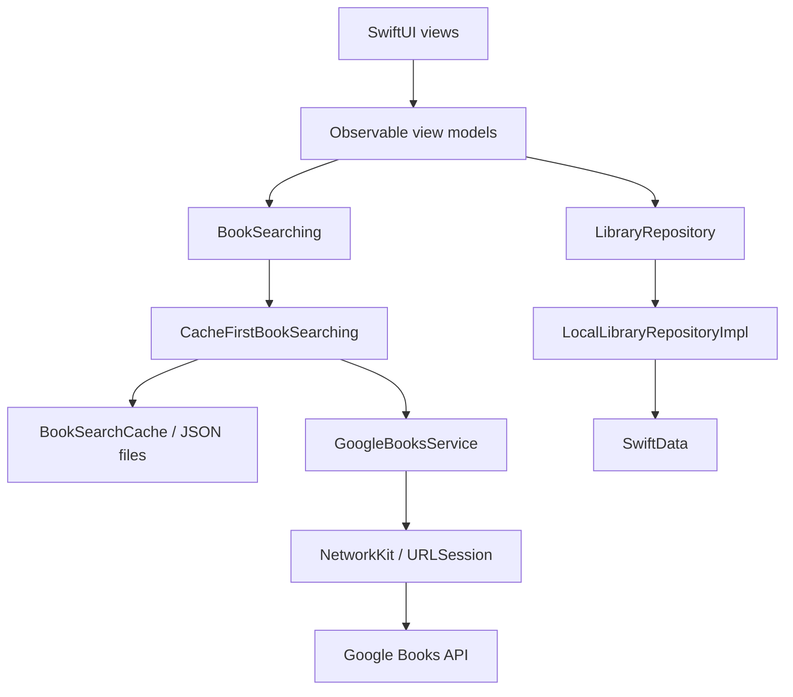

# BookTrace

BookTrace is a native iOS app for discovering books, organizing a personal library, and tracking reading time and progress. Find books through Google Books, keep your reading list on your device, and turn reading sessions into a record of your activity and pace.

Built with **SwiftUI**, **SwiftData**, and local **Swift packages**, the project uses MVVM and repository abstractions to keep presentation, persistence, networking, and domain logic separate.

## Contents

- [Features](#features)
- [Technology stack](#technology-stack)
- [Requirements](#requirements)
- [Getting started](#getting-started)
- [Google Books API configuration](#google-books-api-configuration)
- [Using BookTrace](#using-booktrace)
- [Architecture](#architecture)
- [Project structure](#project-structure)
- [Reading progress and estimates](#reading-progress-and-estimates)
- [Storage and offline behavior](#storage-and-offline-behavior)
- [Localization and appearance](#localization-and-appearance)
- [Build and test](#build-and-test)
- [Troubleshooting](#troubleshooting)
- [Project status and roadmap](#project-status-and-roadmap)

## Features

### Book discovery

- Search Google Books by title, author, or other search terms, with a 500 ms delay after typing to reduce unnecessary requests.
- Browse six featured shelves: Fiction, Science Fiction, History, Philosophy, Technology, and Biography.
- Scan book barcodes with the device camera and look up the corresponding ISBN.
- View book descriptions, authors, covers, subjects, page counts, publication dates, and ISBNs when available.
- Retry individual shelves when a request fails; each shelf loads independently.
- Reuse cached search, subject, and ISBN results for up to 24 hours.

### Personal library

- Organize books by reading status: **Wishlist**, **To Read**, **Reading**, **Finished**, or **Abandoned**.
- Track ownership as **Borrowed**, **Not Owned**, or **Owned**.
- Add custom categories or choose suggestions from existing tags and the book's subjects.
- Set a page count and choose progress entry in pages or percentages.
- See current books, progress bars, and estimated remaining time in **Now Reading**.
- Update existing library details while preserving reading progress and saved sessions.
- Remove individual books or erase the library from Settings.

### Reading sessions

- Start a full-screen timer from a book in your library.
- Pause and resume, then finish by recording the number of pages read.
- Save the session to advance progress and update the reading status when appropriate.
- Review a book's session history and accumulated reading time.
- Get a remaining-time estimate that adapts to the sessions recorded for that book.

Reading Mode tracks time spent reading a book outside the app; BookTrace does not currently include an EPUB or PDF reader.

### Profile and settings

- View library totals, books in progress, and finished books.
- Review total reading time, recorded pages, session counts, and reading pace.
- Inspect reading-status and ownership breakdowns and the five most recent sessions.
- Choose System, Light, or Dark appearance.
- Switch between the system language, English, Turkish, and German.
- Set the default reading status and progress type for newly added books.
- Clear the search cache independently of the personal library.

## Technology stack

| Area | Technology | Role |
| --- | --- | --- |
| Interface | SwiftUI | Screens, forms, navigation presentation, and shared components |
| State | Observation | Observable view models and shared application settings |
| Persistence | SwiftData | Library entries, categories, and saved reading sessions |
| Networking | Foundation / URLSession | Asynchronous requests through the local `NetworkKit` package |
| Dependency injection | [FactoryKit](https://github.com/hmlongco/Factory) | Service registration and dependency composition |
| Navigation | [NavigatorUI](https://github.com/hmlongco/Navigator) | Independent navigation stacks for each tab |
| Cover images | [Kingfisher](https://github.com/onevcat/Kingfisher) | Remote image loading and caching |
| Barcode scanning | AVFoundation | Camera access and barcode capture |
| Localization | String Catalogs | English, Turkish, and German interface strings |
| Testing | Swift Testing | Domain, cache behavior, and endpoint tests |

Dependencies are managed through Swift Package Manager. The committed Xcode [dependency resolution](BookTrace.xcodeproj/project.xcworkspace/xcshareddata/swiftpm/Package.resolved) records Factory **3.3.2**, Navigator **2.1.3**, and Kingfisher **8.11.0**.

## Requirements

| Requirement | Details |
| --- | --- |
| Development environment | macOS with Xcode 26.x and a Swift 6.2 or newer toolchain |
| Deployment target | iOS 17.6 or later; the app target includes iPhone and iPad |
| Book discovery | Internet access and a Google Books API key |
| Barcode scanning | A physical device with an available camera and camera permission |

The app target uses Swift 5 language mode, while the local packages use Swift 6 tools. In particular, `Models/Package.swift` requires Swift tools version 6.2. Use the app target's iOS 17.6 deployment setting when checking device compatibility; it overrides the project-level default.

## Getting started

1. Clone the repository:

   ```bash
   git clone https://github.com/semihtakilan/BookTrace.git
   cd BookTrace
   ```

2. Open the Xcode project:

   ```bash
   open BookTrace.xcodeproj
   ```

3. Allow Xcode to resolve Swift package dependencies. Keep `Models`, `NetworkKit`, and `NetworkRegistration` beside the app project; they are local package dependencies.
4. Configure `GOOGLE_BOOKS_API_KEY` using the [steps below](#google-books-api-configuration).
5. Select the **BookTrace** scheme and an iOS Simulator or connected device.
6. For a physical device, select your development team under **Signing & Capabilities** and adjust the bundle identifier if needed for your signing setup.
7. Run the app with **Command-R**.

You can explore the library, discovery, and profile flows in the Simulator. Use a physical device to exercise camera scanning.

## Google Books API configuration

BookTrace uses the Google Books [volumes endpoint](https://developers.google.com/books/docs/v1/reference/volumes/list) for text search, subject shelves, and ISBN lookup:

```text
GET https://www.googleapis.com/books/v1/volumes
```

The app uses public book metadata and keeps its personal library locally. It does not require Google sign-in or access a user's Google Books bookshelves.

Text search requests up to 20 results, each subject shelf requests up to 15, and barcode lookup requests one result. Discovery currently displays a single batch per query; pagination is not implemented.

### Create an API key

1. Open the [Google Cloud Console](https://console.cloud.google.com/) and create or select a project.
2. Under **APIs & Services → Library**, enable **Books API**.
3. Open **APIs & Services → Credentials → Create credentials → API key**.
4. Limit the key's API access to Books API and review the project's quota settings.

Google documents API keys as an application identifier for public-data requests. See the [Google Books API guide](https://developers.google.com/books/docs/v1/using) for credential requirements. Configure your own key for discovery; although the client still attempts requests when no key is available, those requests can fail with access or quota errors.

### Option A: Xcode scheme environment variable

For local development:

1. Open **Product → Scheme → Edit Scheme**.
2. Select **Run → Arguments**.
3. Add and enable this entry under **Environment Variables**:

   | Name | Value |
   | --- | --- |
   | `GOOGLE_BOOKS_API_KEY` | Your Google Books API key |

4. Stop and relaunch the app from Xcode.

Keep the key in your local user scheme; do not commit a shared scheme containing credentials. A Run environment variable is supplied by Xcode at launch and is not embedded in an archived or installed app.

### Option B: App bundle configuration

For launches that do not receive an Xcode Run environment, the app also reads a string named `GOOGLE_BOOKS_API_KEY` from its `Info.plist`.

The project generates its `Info.plist` through Xcode. Add the following entry under **BookTrace target → Info → Custom iOS Target Properties**:

| Property | Type | Value |
| --- | --- | --- |
| `GOOGLE_BOOKS_API_KEY` | String | `$(GOOGLE_BOOKS_API_KEY)` |

Supply the corresponding build setting through your build environment or a local `Secrets.xcconfig` attached to the appropriate build configuration. For example, that local configuration can define:

```xcconfig
GOOGLE_BOOKS_API_KEY = YOUR_GOOGLE_BOOKS_API_KEY
```

`Secrets.xcconfig` is ignored by Git, but the repository does not create or attach it automatically. A value embedded in the app bundle remains readable from that bundle.

### Configuration behavior

- A process environment value takes precedence over the bundled value.
- Whitespace is trimmed. An empty value or an unresolved `$(...)` placeholder is treated as a missing key.
- `.env` files are not loaded by the app.
- Requests include a `country` value from `Locale.current.region`, with `US` as the fallback. This follows the device region, independently of the app's selected interface language.
- The network logger can include the API key in request URLs. Remove the `key` query value before sharing logs.

## Using BookTrace

1. Open **Explore** and search for a book, browse a subject shelf, or scan a barcode.
2. Open the book's details and choose **Add to Library**.
3. Set the reading status, ownership, page count, progress type, and categories, then save.
4. Open **Library** and select the book. Use **Update progress** for a manual update or **Reading Mode** to time a session.
5. In Reading Mode, choose **Finish**, enter the number of pages read, and select **Save Session**.
6. Visit **Profile** to review activity and open the gear button for Settings.

When you encounter a book that is already saved, **Update Library Details** edits its existing entry. Library identity is based on the Google Books volume ID, so different editions can remain separate entries.

## Architecture

BookTrace follows **MVVM with repository abstractions**. Views observe view models, and view models depend on domain protocols. Concrete services and persistence are assembled at the application boundary.



### Local packages

| Package | Responsibility |
| --- | --- |
| [Models](Models) | Domain values, repository protocols, progress rules, reading-speed estimates, and the cache-first search decorator; independent of SwiftUI and SwiftData |
| [NetworkKit](NetworkKit) | Typed endpoints, the `NetworkService` actor, HTTP request construction, request/response interceptors, logging, and retries for eligible failures |
| [NetworkRegistration](NetworkRegistration) | Factory registrations for networking configuration, the environment manager, and request/response interceptors |

### Key implementation choices

- **Composition root:** `AppDependencies` creates the SwiftData container and connects the concrete repository to Factory registrations.
- **View model creation:** `ViewModelFactory` supplies dependencies to navigation destinations through the SwiftUI environment.
- **Portable models:** `BookReference` carries Google Books metadata; `LibraryEntry` adds the user's state. SwiftData models convert to and from these domain values.
- **Tab navigation:** Library, Explore, and Profile each have their own Navigator instance.
- **Data refresh:** `LibraryChangeNotifier` publishes a revision after successful writes so library details, shelves, and profile statistics refresh after changes.
- **Error presentation:** `UserFacingError` maps service and persistence errors into localized messages and suppresses cancellation errors.

## Project structure

```text
BookTrace/
├── BookTrace/
│   ├── App/                         # App entry point, root views, and tab routing
│   ├── Core/
│   │   ├── DI/                      # Registrations and dependency composition
│   │   ├── ErrorPresentation/       # User-facing error mapping
│   │   ├── Settings/                # Persisted theme, language, and defaults
│   │   └── ViewState/               # Loading, success, and failure state
│   ├── Data/
│   │   ├── Caching/                 # Search-result disk cache
│   │   ├── Network/                 # Google Books endpoint and response mapping
│   │   ├── Persistence/             # SwiftData models and library repository
│   │   └── Services/                # Book lookup and API-key resolution
│   ├── Domain/Repositories/         # App-facing repository protocol aliases
│   ├── Presentation/
│   │   ├── Features/
│   │   │   ├── Books/               # Library, book progress, and reading sessions
│   │   │   ├── Explore/             # Search, discovery, details, and scanning
│   │   │   ├── Profile/             # Reading statistics and settings
│   │   │   └── Splash/              # Launch screen
│   │   └── Shared/                  # Covers, rows, tags, and formatters
│   ├── Assets.xcassets/
│   └── Localizable.xcstrings
├── BookTrace.xcodeproj/
├── Models/
│   ├── Sources/Models/
│   └── Tests/ModelsTests/
├── NetworkKit/
│   ├── Sources/NetworkKit/
│   └── Tests/NetworkKitTests/
├── NetworkRegistration/
│   └── Sources/NetworkRegistration/
├── Plan.md                          # Original development plan, in Turkish
└── README.md
```

## Reading progress and estimates

### Domain model

| Type | Purpose |
| --- | --- |
| `BookReference` | A volume ID and available metadata, including title, authors, cover URL, page count, description, ISBN, and subjects |
| `LibraryEntry` | A book plus reading status, ownership, preferred progress unit, current page, categories, and saved sessions |
| `ReadingSession` | A session ID, start date, active duration in seconds, and number of pages read |
| `Category` | A user tag with an identity derived from its normalized name |
| `ReadingSpeedEstimator` | Pure calculations for reading pace and estimated remaining time |

### Progress rules

Progress is stored as a page number. Percentage entry is converted to pages, keeping session updates and estimates in the same unit.

A positive user-supplied page count takes precedence over the count returned by Google Books. Without a known total, the app can record pages and sessions, but percentage progress and remaining-time estimates are unavailable.

Saving a reading session adds its pages to the current position, caps that position at the known page count, moves Wishlist or To Read entries into Reading, and marks an entry Finished when the known total is reached. Manual progress changes do not create timed sessions and therefore do not contribute to recorded reading pace.

### Reading pace

Before recorded totals include both positive time and positive pages, the estimate uses **120 seconds per page**. Once measurements are available for a book:

```text
seconds per page = total recorded seconds / total recorded pages
remaining time   = remaining pages × seconds per page
```

Each book's estimate uses its own sessions. Profile statistics also calculate an overall pace across the library's saved sessions. Time estimates are omitted when the total page count is unknown or no pages remain.

The session timer measures elapsed time from timestamps and accumulated active intervals. It stays accurate when the app returns from the background and excludes paused time. The active timer is held in memory; only saved sessions survive an app relaunch.

## Storage and offline behavior

| Data | Storage | Behavior |
| --- | --- | --- |
| Library metadata, categories, and sessions | SwiftData | Persisted on the device and available without fetching book details again |
| Search, subject, and ISBN results | JSON files in the app's `BookSearchCache` cache directory | Reused for up to 24 hours; expired entries are removed when read |
| Cover images | Kingfisher cache | Cached separately from search results; a generated placeholder appears while unavailable |
| Theme, language, and new-book defaults | UserDefaults | Restored on subsequent launches |

Library management, saved progress, session recording, and profile calculations work locally. Discovery can reuse a matching, unexpired cache entry while offline; new or expired queries require a connection. An uncached cover image also needs a download.

**Clear search cache** removes the stored discovery results. It does not erase library entries, reading sessions, or Kingfisher's image cache, and already displayed results may remain in memory. **Erase library** removes all saved books, their sessions, and stored categories after confirmation.

The current implementation has no account system, cloud synchronization, or library import/export.

## Localization and appearance

Interface strings live in [BookTrace/Localizable.xcstrings](BookTrace/Localizable.xcstrings), with English as the source language and Turkish and German translations. Theme and language preferences are applied at the root view and updated through Settings.

When adding interface text, use the existing localization approach and update the string catalog. Book titles, descriptions, and source subjects remain the metadata supplied by Google Books; the interface language setting does not translate that content.

## Build and test

Run commands from the repository root with the required Xcode toolchain selected.

### Build for the Simulator

```bash
xcodebuild \
  -project BookTrace.xcodeproj \
  -scheme BookTrace \
  -configuration Debug \
  -destination 'generic/platform=iOS Simulator' \
  -derivedDataPath build/DerivedData \
  CODE_SIGNING_ALLOWED=NO \
  build
```

This builds the app without installing or launching it. API credentials are needed for live discovery requests, not for compilation.

### Run package tests

```bash
swift test --package-path Models
swift test --package-path NetworkKit
```

The existing Swift Testing suites cover:

| Suite | Coverage |
| --- | --- |
| `LibraryEntryTests` | Defaults, page-count overrides, progress calculations, session application, and status transitions |
| `ReadingSpeedEstimatorTests` | Default pace, measured pace, and remaining-time estimates |
| `CacheFirstBookSearchingTests` | Cache hits and misses, separate query keys, and ISBN lookup behavior |
| `EndpointTests` | URL construction, query encoding, HTTP methods, request bodies, and default endpoint behavior |

These tests use local values and mocks; they do not call Google Books or require an API key. Swift Package Manager may need network access to resolve dependencies before the first run. The repository currently has no app-level UI test target, and `NetworkRegistration` has no dedicated test target.

## Troubleshooting

| Symptom | What to check |
| --- | --- |
| Discovery displays a quota or access error | Confirm that `GOOGLE_BOOKS_API_KEY` is supplied to the running app, Books API is enabled, and the key's restrictions and project quotas allow the request. The app groups HTTP 403 and 429 into its quota message. |
| The key works from Xcode but not when launching the installed app | A scheme variable is supplied only during an Xcode launch. Configure the bundled value for other launch paths. |
| Requests return HTTP 503 | Retry, then check the device or Simulator region under **Settings → General → Language & Region → Region**, including any difference introduced by a VPN. The request uses that region; a 503 can also be a service-side failure. |
| Scanning reports no camera | Use a physical device. In the Simulator, search by title or enter an `isbn:` query instead. |
| Camera access is off | Use **Open Settings** from the scanner to enable camera access for BookTrace. |
| Percentage progress or remaining time is missing | Provide a positive page count in the book's library details. |
| Discovery results have not changed | Results are cached for 24 hours. Clear the search cache in Settings and relaunch to reload shelves already held in memory. |
| Xcode reports a missing local package | Check that all three package directories are present beside `BookTrace.xcodeproj`. |
| Swift tools version is unsupported | Select an Xcode installation that includes Swift 6.2 or newer and check the active command-line toolchain. |
| Device signing fails | Set your development team and, if needed, a bundle identifier available to that team. |

## Project status and roadmap

Book discovery, library management, timed reading sessions, pace estimates, profile statistics, themes, and language settings are implemented.

The following work remains planned:

- Author search, author profiles, and bibliographies.
- Recommendations based on library subjects and categories.
- Reading goals, streak calendars, and reading trends with Swift Charts.

See [Plan.md](Plan.md) for the original phased development plan, written in Turkish. Its phase checklists predate some of the implemented profile and settings features described here.
